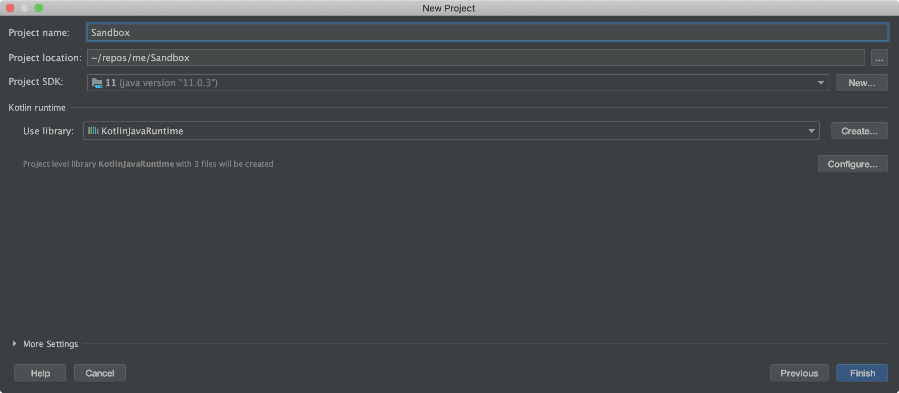
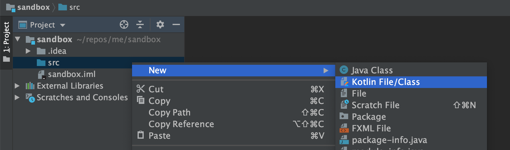
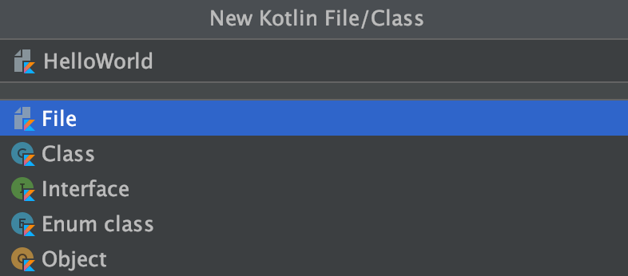
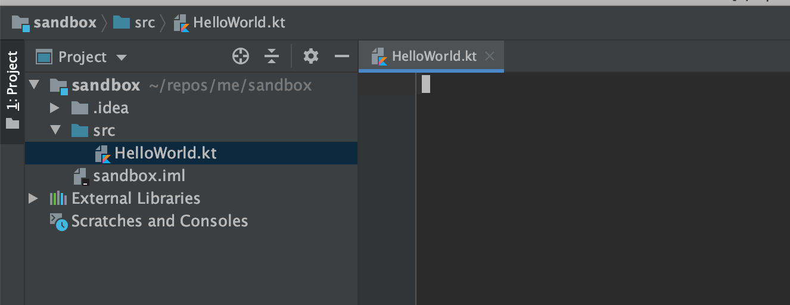
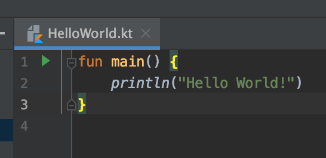
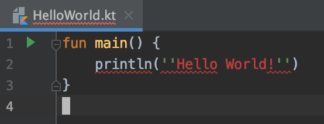
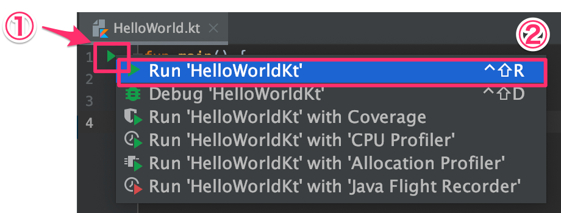
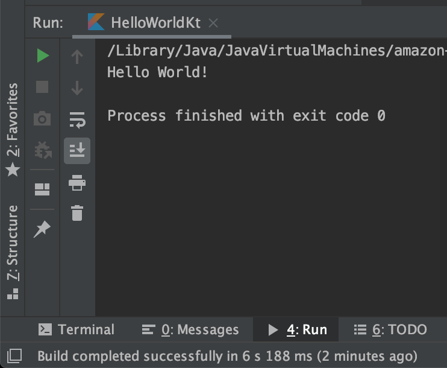

# Hello World
Kotlin を用いたプログラミングを行うための準備をしていきましょう。

まずは、 IntelliJ IDEA を起動しましょう。
起動すると、 "Welcome to IntelliJ IDEA" という画面が表示されます。
"Create New Project" をクリックし、次の画面に進みます。


"Create New Project" の画面では、どのプログラミングで何を作るかを指定します。
今回は Kotlin 言語で JVM 向けのアプリケーションを作成するため、 "Kotlin" → "Kotlin/JVM" を指定し、次の画面へ進みます。


"New Project" 画面では、プロジェクトの設定を行います。

* "Project Name"
    * 自由に設定
        * 半角アルファベットのみを利用することを強く推奨
* "Project Location"
    * 自由に設定
    * 末尾は自動的に "Project Name" で指定した名前が設定される
        * 特に理由がなければ、 `~/IdeaProjects/("Project Name" で指定した名前)`
* "Project SDK"
    * Java 8 を指定
        * Java 11 でも OK ですが、この資料は Java 8 で作成しています
        * 特に理由がない場合は Java 8, 11 以外を指定しない
        * Java 5 以下は Kotlin の仕様上指定不可
    * 何も指定できない場合は、下記のいずれからダウンロードしてインストール
        * [Amazon Corretto 8](https://docs.aws.amazon.com/ja_jp/corretto/latest/corretto-8-ug/downloads-list.html)
        * [Oracle Java SE 8 JDK](https://www.oracle.com/technetwork/java/javase/downloads/index.html)



プロジェクトの設定が完了すると、左側にプロジェクトツールウィンドウ、右側にエディタ (現時点では空) が表示されます。
ここからは、ソースコードを作成していきます。
プロジェクトツールウィンドウの "sandbox" をダブルクリックして開き、 "src" を右クリック、 "New" → "Kotlin File/Class" を選択します。



次に、 Kotlin のファイル名とテンプレートを指定します。
ファイル名は `HelloWorld` 、テンプレートはデフォルトの "File" を指定し、 Enter を押します。



"HelloWorld.kt" が作成され、エディタが開きました。
この時点ではまだ HelloWorld.kt は空のファイルです。



いよいよ、プログラムを作成します。
世界で最も有名なプログラムである "Hello World!" を表示するプログラムを作成します。

エディタで下記の通り入力してください。
1文字も間違えないように気をつけましょう。

```kotlin
fun main() {
    println("Hello World!")
}
```



`"` はダブルクオーテーションです。
もし間違えて `'` (シングルクォーテーション) を2つにしてしまった等の誤りがある場合、下図のように赤く警告がでます。



無事正しく入力できたら、いよいよ実行します。
`fun main() {` の行の左に緑色の三角があります。
これをクリックした後に、 "Run 'HelloWorldKt" をクリックします。



少し待つと、 "4: Run" ツールウィンドウが開き、 `Hello World!` を表示した上でプログラムが終了したら成功です。



無事に `Hello World!` と表示されたならば、 Kotlin でのプログラミングの第一歩が完了です。

